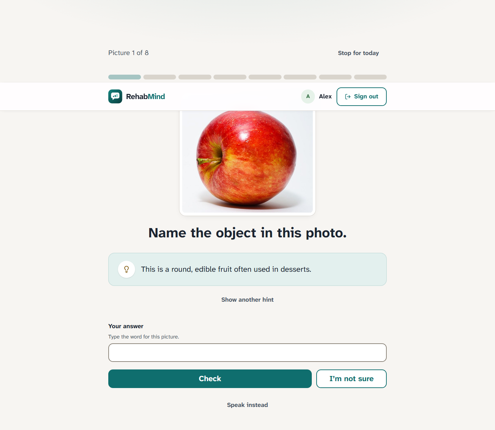
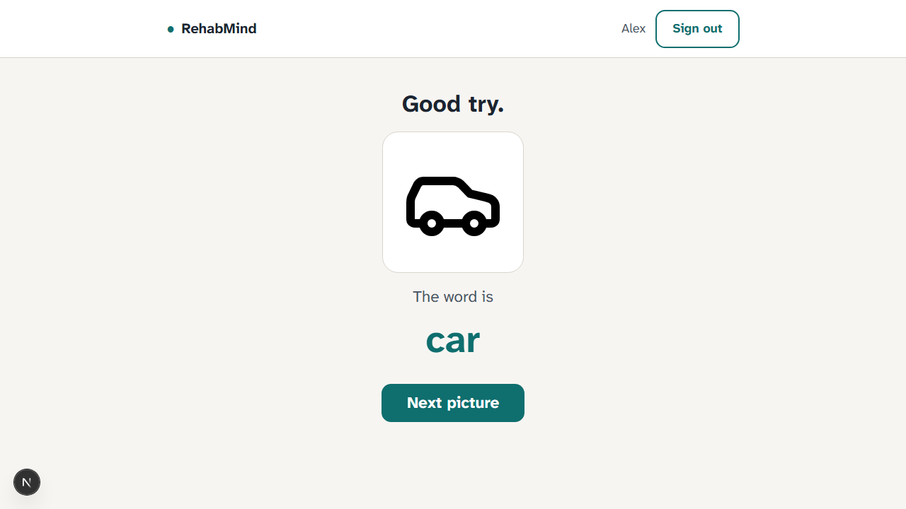
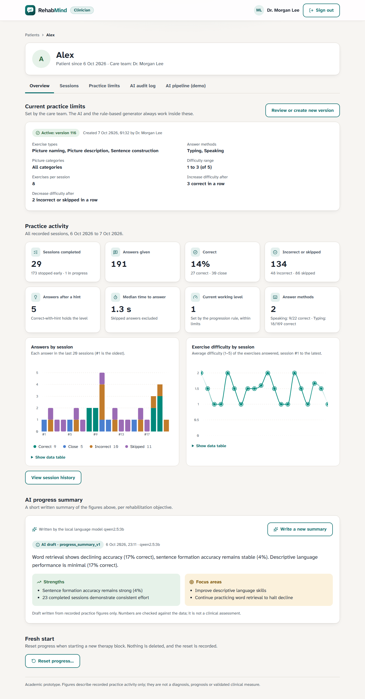
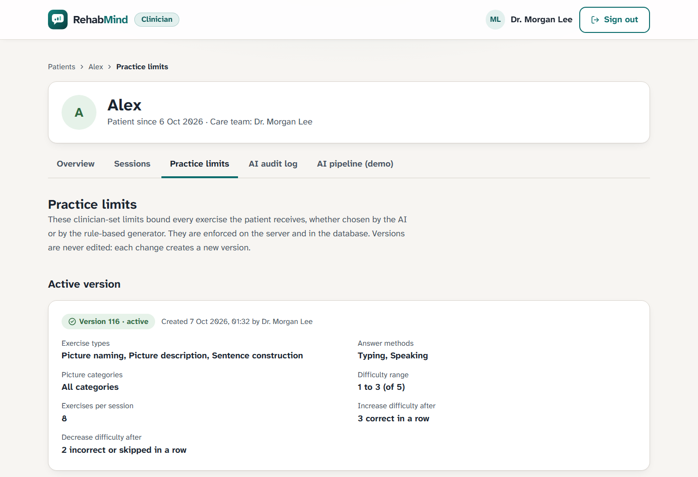
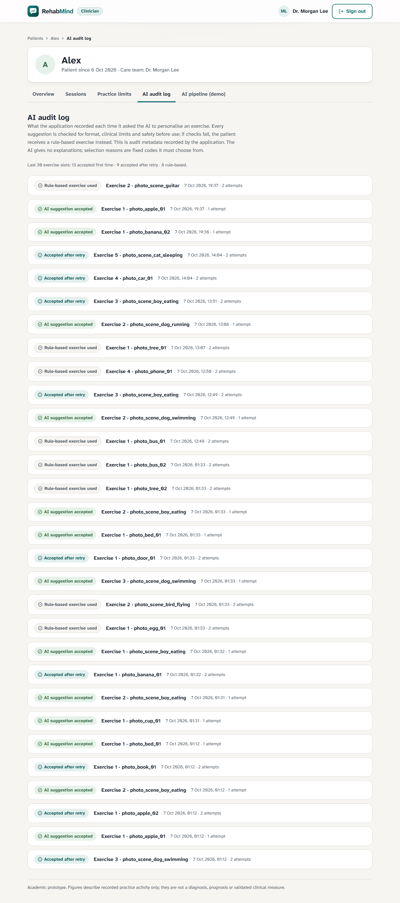
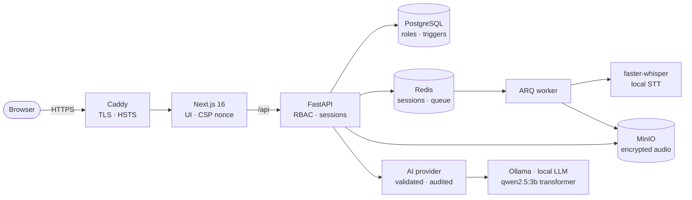
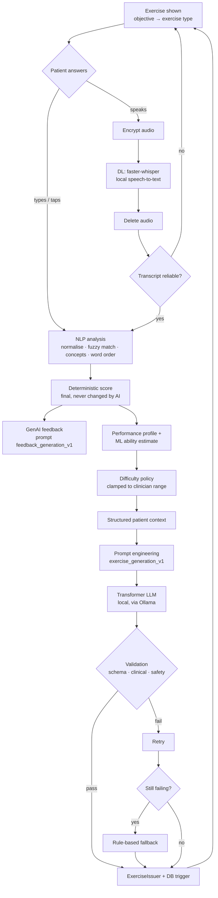
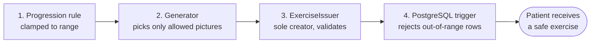

#  RehabMind

**AI-assisted, clinician-bounded speech and language practice for people recovering from
stroke-related aphasia.**


-6A1B9A?style=for-the-badge&labelColor=555)


Patients name pictures by **speaking or typing**. RehabMind transcribes speech on its own
server, scores each answer, and personalizes the next exercise, always **inside limits set
by the patient's clinician**. Clinicians see real practice data, manage those limits as
versioned settings, and can audit every AI decision.

> ⚠️ Academic / research prototype. Not a diagnostic tool, not clinically validated, and
> not an autonomous system: the clinician is always the authority.

---

## 📸 Screenshots

| Patient: picture naming with hints | Patient: supportive feedback |
|---|---|
|  |  |

| Clinician: patient overview & trends | Clinician: versioned practice limits |
|---|---|
|  |  |

<details>
<summary><b>Clinician: AI audit log</b></summary>


</details>

---

## ✨ Highlights

| 🧑‍🦽 Patients | 🩺 Clinicians | 🛡️ Safety by design |
|---|---|---|
| Real-world photos (61, openly licensed) plus line drawings | Dashboard of assigned patients (real data only) | `MAX_DIFFICULTY` enforced in 4 independent layers, incl. a DB trigger |
| Answer by **voice or typing**; naming, sentence building, picture description | Accuracy & difficulty trends, session history | Generative AI is bounded: schema → clinical → safety validation |
| Hints: meaning first, then first sound | **Versioned practice limits** (never edited, only superseded) | Retry + deterministic fallback; patients are never blocked |
| Warm, honest feedback with the correct word | **AI audit log**: suggestion, verdict, what the patient got | Audio **encrypted → transcribed locally → deleted** |
| Large targets, legible font, reduced motion | Transcript confidence, never raw audio | Whisper hallucinations are never scored |

---

## 🏗️ Architecture



Modular monolith plus a background worker. Only Caddy is exposed. The API, database, cache and
storage are internal.

## 🔁 Core practice loop



Full GenAI write-up (ML, DL, NLP, transformer, prompts, examples):
[docs/review2-genai.md](docs/review2-genai.md).

## 🛡️ Clinical safety layers



The runtime database role cannot alter tables, disable the trigger, or edit constraint
versions and audit logs.

---

## 🧰 Tech stack

| Layer | Technology |
|---|---|
| Frontend | Next.js 16 (App Router) · TypeScript · Tailwind CSS 4 · Zod · Lucide |
| Backend | FastAPI · Pydantic v2 · SQLAlchemy 2 (async) · Alembic |
| Data | PostgreSQL 18 · Redis 8 · MinIO (S3-compatible) |
| Speech | faster-whisper `small.en` (CPU int8, self-hosted) |
| AI | Local transformer LLM (Qwen2.5 3B via Ollama) behind a provider interface · offline fake provider for tests |
| Ops | Docker Compose · Caddy · GitHub Actions |
| Testing | pytest · Hypothesis · Vitest · Playwright · axe-core |

## 🚀 Quick start

```bash
cp .env.example .env                       # fill in the change-me values
docker compose up -d --wait
cd backend
uv run python -m app.scripts.provision_storage
uv run alembic upgrade head && uv run python -m app.scripts.seed_dev
uv run uvicorn app.main:app --port 8000    # API
uv run python -m app.workers.main          # speech worker (second terminal)
cd ../frontend && npm install && npm run dev   # → http://localhost:3000
```

Real generative AI (local, $0): install [Ollama](https://ollama.com), run
`ollama pull qwen2.5:3b`, and set `AI_PROVIDER=ollama` in `.env` (optionally
`AI_DEMO_VIEW=true` for the clinician's step-by-step AI pipeline view).

Self-hosted HTTPS stack: `docker compose --env-file .env.production -f compose.prod.yaml up -d --build`
(see [deployment](docs/deployment.md)).

## ✅ Quality

- **146** backend tests, including property-based tests of the max-difficulty rule
- Frontend unit tests and **Playwright end-to-end** tests, with axe accessibility checks on every screen
- Phone and tablet layout checks, dependency audits, and a CI workflow

## 📚 Documentation

[Architecture](docs/architecture.md) ·
[Clinical constraints](docs/clinical-constraints.md) ·
[AI pipeline](docs/ai-pipeline.md) ·
[Clinician workflow](docs/clinician-workflow.md) ·
[Security](docs/security.md) ·
[Privacy](docs/privacy.md) ·
[Accessibility](docs/accessibility.md) ·
[Deployment](docs/deployment.md) ·
[Development](docs/development.md) ·
[Photo credits](docs/photo-credits.md)
