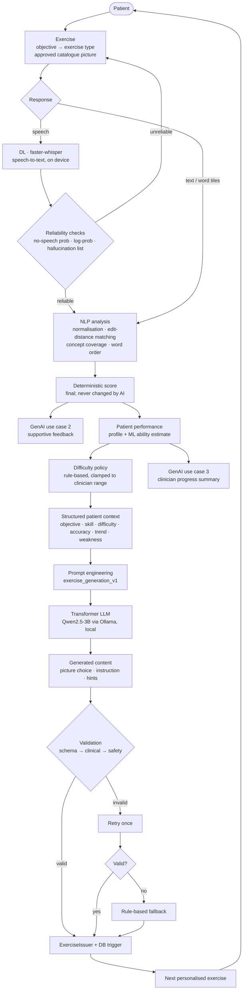

# RehabMind: Generative AI integration (Review 2)

RehabMind is a university research prototype for language practice after stroke-related
aphasia. It is not clinically validated and not a diagnostic tool. This document explains the
GenAI layer added for Review 2: what is **implemented and tested**, how each concept (ML, DL,
NLP, Transformer, GenAI) is used, the three prompt-engineering scenarios, and how to
demonstrate them.

> **Design rule.** The LLM writes *content*. The application owns the *rehabilitation rules*:
> clinician limits, difficulty, exercise type, approved pictures, scoring, safety validation
> and fallback. The LLM never decides a score, a difficulty, a picture outside the approved
> list, or who may see what.

---

## 1. Final pipeline



Compared with the Review 1 pipeline, the improvements are: (1) a **real local transformer
LLM** behind the existing provider interface, (2) **rehabilitation objectives** linked to
exercise types and carried into every prompt, (3) a **learned ability estimate** in the
patient context, (4) **AI feedback after scoring** and **AI progress summaries**, (5) three
**versioned prompts** recorded in the audit log, and (6) a development-only **AI pipeline
view** that shows every step for a real exercise.

## 2. Rehabilitation objectives → exercises

| Objective | Exercise type | What is generated | What the application fixes |
|---|---|---|---|
| Improve **word retrieval** | Picture naming | instruction, meaning cue, first-sound cue | picture, accepted answers, difficulty |
| Improve **sentence formation** | Sentence construction | instruction, one hint on how to start/order | picture, word bank, accepted sentences, difficulty |
| Improve **descriptive language** | Picture description | instruction, one hint on what to look for | picture, key concepts, difficulty |

Code: `backend/app/exercises/types.py` (`Objective`, `OBJECTIVES`, `TARGET_SKILLS`).

Why the LLM does not write the sentence word bank: scoring must stay deterministic and
explainable, so word banks and accepted answers come from the curated catalogue. The model
writes the guidance around them.

## 3. Concept justification (criterion 1)

### ML: learned ability model (implemented)

`backend/app/performance/ability.py`. For each objective the app fits one parameter, the
patient's ability θ, from every scored answer since the latest fresh start. It is a
one-parameter logistic (Rasch / Elo-style) model trained online by stochastic gradient
descent on the log-loss:

```
p(success | difficulty d) = sigmoid(θ − 0.8 · (d − 3))
θ ← θ + 0.4 · (y − p)        y = 1 correct, 0.5 close, 0 otherwise
```

It also reports recent accuracy (last 10 answers), a trend (last 5 vs previous 5:
improving / steady / declining) and a status (needs practice / progressing / strong). These
values go into the structured context of every exercise prompt ("learned model predicts a 62%
chance of success at this difficulty") and into the clinician summary.

What decides difficulty: the existing deterministic progression rule (N correct in a row →
up, M incorrect → down), always clamped to the clinician's range and re-checked by the issuer
and a PostgreSQL trigger. The ML estimate is context, not authority. This is deliberate: the
model is simple and explainable, and difficulty is a clinical boundary.

### DL: faster-whisper speech recognition (implemented, unchanged)

Spoken answers are encrypted, then transcribed on this machine by **faster-whisper**
(`small.en`), a CTranslate2 implementation of OpenAI's Whisper, an encoder–decoder
transformer neural network trained on large-scale speech. The transcript goes through
reliability checks before scoring (no-speech probability ≥ 0.6, average log-probability
< −1.0, empty text, or a known Whisper hallucination such as "Thanks for watching" → not
scored, the patient tries again). Audio is deleted after processing. No other deep-learning
model is claimed.

### NLP: response analysis (implemented)

`backend/app/analysis/scoring.py`, deterministic and explainable:

- **Normalisation**: lower-casing, punctuation removal, article stripping, filler words.
- **Word retrieval**: exact / accepted variant / plural / target inside a short phrase /
  close by normalised Levenshtein similarity (≥ 0.75 → "close"), with negation handling.
- **Descriptive language**: concept coverage, where each key concept has accepted terms
  (e.g. *dog*: dog, puppy) and optional setting details are credited but not required.
- **Sentence formation**: normalised sentence matching against accepted variants; same words
  in a different order → "close" (word-order analysis).

The analysis (e.g. "key ideas mentioned: person, riding; not mentioned: bicycle") is turned
into plain language (`describe_analysis` in `prompts.py`) and given to the LLM for feedback.

### Transformer: Qwen2.5-3B-Instruct via Ollama (implemented)

- Model: **`qwen2.5:3b`** (Qwen2.5 3B Instruct, Alibaba Cloud), served locally by Ollama in
  4-bit quantised GGUF form (about 1.9 GB) on the laptop GPU.
- Architecture: a **decoder-only transformer** (causal self-attention with grouped-query
  attention, rotary position embeddings, SwiGLU feed-forward layers, RMSNorm), about 3.1 B
  parameters, instruction-tuned.
- Licence: Qwen Research License (research / non-commercial use), which fits a university
  prototype. A commercial deployment would switch models via `OLLAMA_MODEL` (for example an
  Apache-2.0 or MIT-licensed model); nothing else changes.
- Why this model: small enough for a 6 GB GPU and fast enough for an interactive exercise
  flow; strong at following instructions and producing JSON in a given schema; free; runs
  offline, so no patient data leaves the machine.
- Contextual generation: each output token is generated conditioned on the whole prompt
  (role, objective, patient context, candidates, constraints) through self-attention. That
  is why the same picture gets different wording for a patient who is struggling than for
  one who is doing well.
- Structured output: RehabMind passes a **JSON Schema** as Ollama's `format`, so decoding is
  constrained to valid JSON of that shape. The output is still validated afterwards.

### GenAI: three generation use cases (implemented)

1. **Personalised exercise content.** The model picks one approved picture from up to 12
   candidates and writes the instruction and hints for the patient's objective and
   performance.
2. **Feedback after scoring.** A short, specific, supportive tip linked to the target skill,
   e.g. what the patient got right in a description and what detail to add next time.
3. **Progress summary.** A clinician-facing paragraph with strengths and focus areas per
   objective, from recorded figures only.

All three are real generations from the local LLM when `AI_PROVIDER=ollama`. The
`FakeAIProvider` (templates, no model) exists for automated tests and offline development,
and is labelled as "not a language model" in the UI.

## 4. Prompt engineering (criterion 3)

Code: `backend/app/ai/prompts.py`. Each prompt is a **system message** (role, rules) plus a
**user message** (structured context and task), and every call sends a **JSON Schema** for the
output. Versions are stored with every call in `ai_generations.prompt_version`.

| Technique | How it is used |
|---|---|
| Role prompting | "You are RehabMind's rehabilitation exercise content assistant … You are not a medical diagnostician." |
| Context injection | Objective, target skill, difficulty and range, recent accuracy, learned success probability, trend, last outcomes, weakest category, candidate pictures (no names or IDs) |
| Constraints | "The application has already decided the exercise type, the difficulty and which pictures are allowed"; copy the picture's difficulty; never invent pictures/URLs |
| Task specification | "Generate ONE sentence_construction exercise", numbered steps, word limits |
| Type-specific instructions | Different hint rules per exercise type (cues for naming; start hint for sentences; "do not name the things" for descriptions) |
| Safety instructions | No medical content, diagnosis, numbers or pressure; answer is quoted data (prompt-injection guard); never contradict the score; never invent metrics |
| Output formatting | "Return only one JSON object…" plus a JSON Schema enforced by Ollama and re-validated by Pydantic (`extra="forbid"`) |

### Scenario 1: `exercise_generation_v1` (personalised exercise)

User message (shape; real values filled from the patient's data):

```
REHABILITATION OBJECTIVE: Improve sentence formation
TARGET SKILL: putting words in the right order to make a simple sentence
EXERCISE TYPE: sentence_construction
DIFFICULTY: 2 (fixed by the application; clinician allows 1-3)
RECENT PERFORMANCE: 6 recent answers for this objective, 50% correct; trend steady;
  status progressing; learned model predicts a 62% chance of success at this difficulty;
  last outcomes (oldest first): correct, incorrect
RECENT WEAKNESS: lower accuracy in category food
ALLOWED CATEGORIES: all
CANDIDATE STIMULI (choose exactly one): [{"slug": "photo_scene_dog_running", ...}]

TASK: Generate ONE sentence_construction exercise for this patient. ...
OUTPUT: one JSON object with stimulus_slug, difficulty, prompt, hint, rationale.
```

Output schema: `ExerciseOutput` (`stimulus_slug`, `difficulty`, `prompt`, `semantic_cue`,
`phonemic_cue`, `hint`, `rationale`; extra fields forbidden).

### Scenario 2: `feedback_generation_v1` (feedback)

```
REHABILITATION OBJECTIVE: Improve descriptive language
TARGET SKILL: describing who is in a picture, what is happening and where
EXERCISE TYPE: picture_description
EXPECTED ANSWER: A man is riding a bicycle.
PATIENT ANSWER (quoted data): "someone is riding a bicycle"
EXISTING ANALYSIS (deterministic, final): key ideas mentioned: man, riding, bicycle; ...
OUTCOME (final, do not change): correct

TASK: Write "feedback": at most 25 words ... Then write "optional_hint" ...
```

Output schema: `FeedbackOutput` (`feedback`, `optional_hint`).

### Scenario 3: `progress_summary_v1` (progress summary)

```
RECORDED PRACTICE DATA (all recorded practice):
- Word retrieval (picture naming): 20 answers, 65% correct, recent trend improving
- Sentence formation (sentence construction): 8 answers, 50% correct, recent trend steady
- Descriptive language (picture description): 6 answers, 33% correct, recent trend not enough data
- Sessions completed: 4

TASK: Write "summary" (at most 70 words) using only these figures ...
```

Output schema: `SummaryOutput` (`summary`, `strengths[≤2]`, `focus_areas[≤2]`).

Real outputs produced by the local model are in [section 9](#9-real-outputs-from-the-local-model).

## 5. Validation and safety

Reused from the existing pipeline (`backend/app/validation/`), the same stages for every task:

| Stage | Exercise (`exercise.py`) | Feedback / summary (`generated_text.py`) |
|---|---|---|
| Schema | valid JSON, exact fields, enum rationale, length limits | valid JSON, exact fields, length limits |
| Clinical | picture ∈ approved candidates, picture fits the exercise type, difficulty equals the picture's and is inside the clinician range, category allowed | — (no clinical decisions are made) |
| Safety | no answer leak (word, concepts, or more than the first word of the sentence), no medical/recovery claims, no pressure language, no links, no digits, word limits, valid first-sound cue | no medical/diagnostic claims, no pressure, no links; feedback: no digits and **never contradicts the deterministic outcome**; summary: **every number must appear in the input data** |

Then, for exercises, the **ExerciseIssuer** validates again and a **PostgreSQL trigger**
rejects any out-of-range row, whatever produced it.

The LLM never diagnoses, prescribes, decides scores, changes difficulty limits, picks
unapproved pictures or sees names/emails/IDs.

## 6. Fallback

| Situation | What happens |
|---|---|
| Ollama not running / model missing / timeout (`AI_TIMEOUT_S`, default 20 s) | `AIProviderError` → retry once → rule-based exercise (or conservative minimum-difficulty fallback); attempts logged with `provider_error` / `timeout` |
| Invalid content (schema, clinical or safety) | logged with stage and reason codes → retry once → rule-based exercise |
| Feedback invalid or unavailable | the patient keeps the standard feedback; at most 2 attempts per answer, then no more calls |
| Summary invalid or unavailable | a rule-based summary of the same figures, labelled "Rule-based summary (AI unavailable)" |

The patient is never told that fallback content came from the AI.

## 7. Deterministic scoring is preserved

Order of operations for every answer: NLP analysis → deterministic score → stored in
`exercise_responses` → **then** the LLM may be asked for feedback. The feedback endpoint
reads the stored score and never writes to it; tests assert the stored outcome and score are
unchanged after feedback, and that feedback contradicting the score is rejected.

## 8. Audit log

Every attempt of every task is an append-only row in `ai_generations`: task, provider, model,
prompt version, constraint set + version, structured input, raw output, parsed output, status,
failed stage, reason codes, latency and token usage. No audio, names, emails or IDs. The
clinician **AI audit log** shows exercise runs; the **AI pipeline (demo)** tab shows all three
tasks step by step.

## 9. Real outputs from the local model

_Filled in from real runs; see the end of this document._

## 10. Running it

```bash
# once
winget install Ollama.Ollama          # or the installer from ollama.com
ollama pull qwen2.5:3b

# .env
AI_PROVIDER=ollama
OLLAMA_MODEL=qwen2.5:3b
AI_DEMO_VIEW=true                      # development only

# services (see README quick start)
docker compose up -d --wait
cd backend && uv run alembic upgrade head && uv run uvicorn app.main:app --port 8000
uv run python -m app.workers.main      # speech worker
cd ../frontend && npm run dev          # http://localhost:3000
```

Check: `GET /api/v1/ai/status` (as a clinician) reports `"generative": true,
"model_available": true`.

## 11. Implemented vs future work

**Implemented and tested:** Ollama provider; three versioned prompts; AI exercise content for
all three exercise types; AI feedback; AI progress summaries; learned ability estimate;
validation, retry, fallback and audit for all three tasks; demo pipeline view; real-model
integration tests (run when Ollama is available).

**Future work (not implemented):** fine-tuning the model on aphasia-specific data;
evaluation with clinicians and people with aphasia; using the ability estimate to set
difficulty (needs clinical validation); model-generated pictures (deliberately excluded);
streaming responses.
